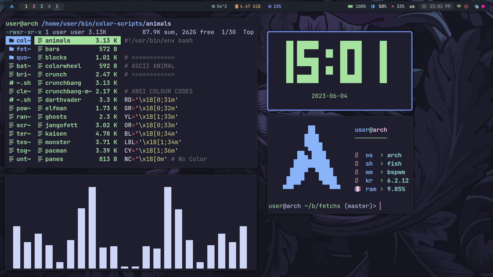
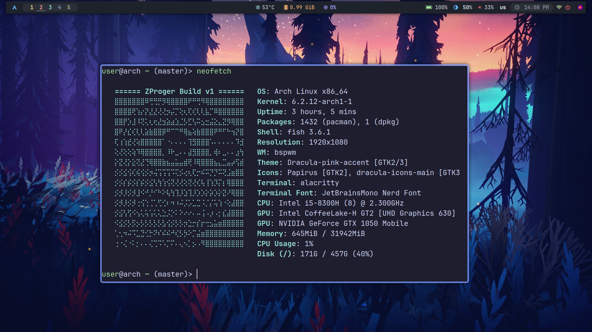
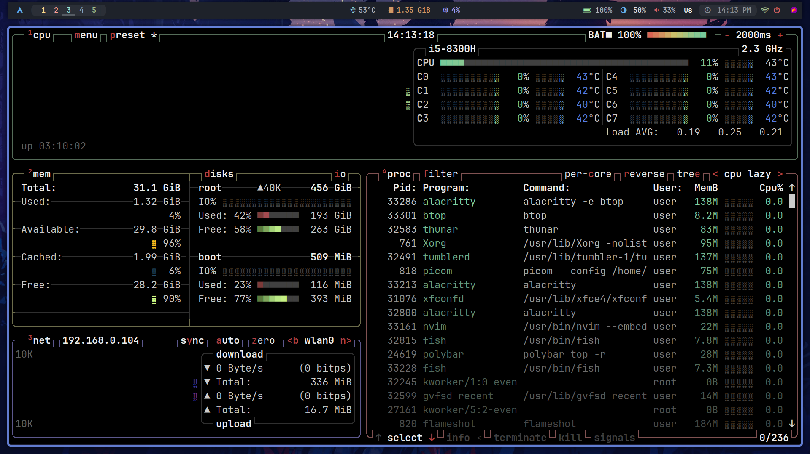
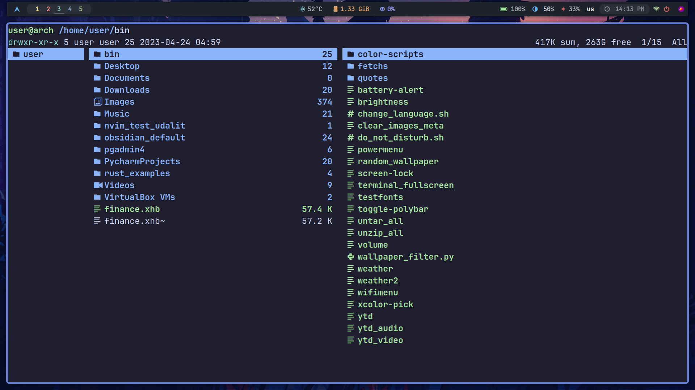
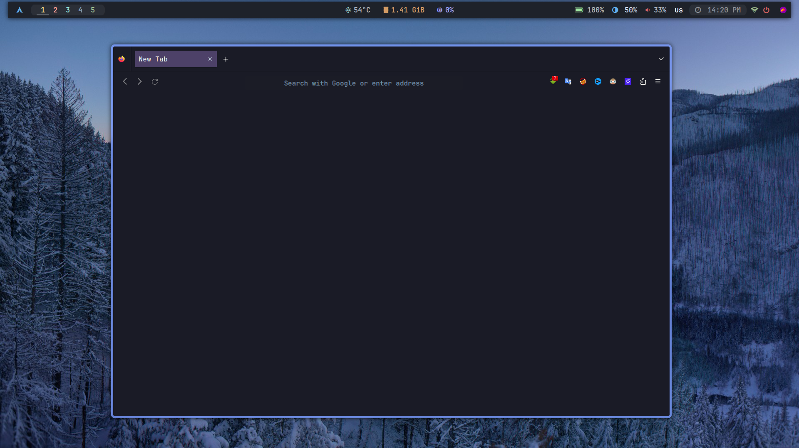
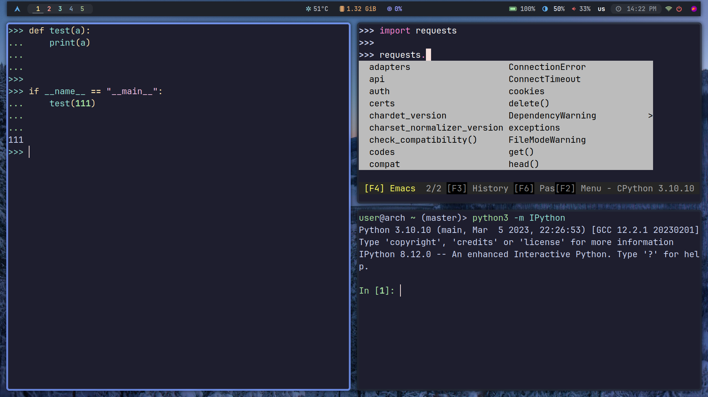

<h1 align="center"> :herb: ZProger Build :herb: </h1>

<!-- BADGES -->
 

  
   
  
  
   

<!-- INFORMATION -->
<h1 align="left"> :blue_book: About</h1> 

 

 - OS: [**`Arch Linux`**](https://archlinux.org/)
 - WM: [**`BSPWM`**](https://github.com/baskerville/bspwm)
 - Bar: [**`Polybar`**](https://github.com/polybar/polybar)
 - Compositor: [**`Picom`**](https://github.com/yshui/picom)
 - Terminal: [**`Alacritty`**](https://github.com/alacritty/alacritty)
 - App Launcher: [**`Rofi`**](https://github.com/davatorium/rofi)
 - Notify Daemon: [**`Dunst`**](https://github.com/dunst-project/dunst)
 - Shell: [**`Fish`**](https://github.com/fish-shell/fish-shell)

 

<!-- IMAGES -->
## 🖼️ Gallery

<!-- FEATURES -->
## 🚀 Features
* Customizing software on the system.
* Support for over 300 dynamic wallpapers.
* Lots of handy scripts in bin/.
* Convenient custom configuration of Firefox.
* All hotkeys are honed for maximum productivity.
* A very lightweight system that consumes less than 700mb of memory.
* Automatic installation and configuration of all basic software for development.

**And more features: [EN](Docs/03_all_features_and_tricks_english.md), [RU](Docs/02_all_features_and_tricks_russian.md)**

<table align="center">
   <tr>
      <th align="center">
         :warning: WARNING :warning:
      </th>
   </tr>
   <tr>
      <td align="center">
        THIS CONFIGURATION IS DESIGNED FOR 1920X1080 MONITORS,
        SOME FUNCTIONALITY OF THE SHELL MAY NOT WORK AS IT SHOULD.
        IN THIS CASE YOU NEED TO MAKE ADJUSTMENTS MANUALLY.
        IF YOU FIND ERRORS IN THE SHELL, PLEASE REPORT THE PROBLEM.
   </tr>
   </table>

<!-- INSTALLATION -->
## :blue_book: Installation
A guide to installing the system and graphical shell via builder: [EN](Docs/01_installing_arch_linux_with_bspwm_english.md), [RU](Docs/00_installing_arch_linux_with_bspwm_russian.md). 

<!-- ERRORS -->
## :moyai: Post-installation fixes
Complete instructions for corrections: https://youtu.be/9zewiGf7j-A
* **The brightness of the screen is not displayed on the bar**. This error is due to the fact that the Builder was unable to automatically install drivers for the video card or processor. You need to go to [Arch Wiki](https://wiki.archlinux.org/) and do the installation manually.
* **The battery is not displayed on the bar**. You need to open `~/bin/battery-alert` and change the `battery` variable to your battery value. Then go to `~/.config/polybar/modules.ini` and edit the `[module/battery]` module according to the polybar instructions to match your `battery` and `adapter` data.
* **Hangs animation or terminals**. The problem is that you may not be using graphics drivers or may be working from a virtual machine. You need to open `~/.config/bspwm/bspwmrc` and comment out the line with the `picom` startup.
* **Interface problem**. If you are not using a `1920x1080 monitor`, the interface may not look like it should. In that case you need to manually edit the configuration.
* **User name error**. At this point, the configuration is installed locally on the user from where the builder was running. Also the username must be `user` for the system to work properly. If you get this error, you need to create a new user named `user` and redo the installation.
* **Other errors**. If you find bugs that aren't listed here and you're sure you followed the manual, then be sure to contact us so we can fix the bug in the next update.

<!-- HOTKEYS -->
## 💻 HotKeys
* **Open the terminal** - `super + enter`
* **Set a random wallpaper** - `super + w`
* **Switch the layout** - `shift + alt`
* **Open the application menu** - `super + d`
* **Derive a random verse from the Bible** - `super + shift + q`
* **Open the browser in incognito mode** - `super + shift + i`
* **Recognize the color on the screen** - `super + shift + x`
* **Lock the screen** - `super + shift + l`
* **Open the console calendar** - `super + shift + k`
* **Launch Telegram** - `super + shift + t`
* **Close the window that is in focus** - `super + c`
* **Take a screenshot** - `print`
* **Restart bspwm** - `ctrl + shift + r`
* **Switch to another desktop** - `super + 1/6`
* **Move the window to another desktop** - `super + shift + 1/6`
* **Switch the window to floating mode** - `super + space`

The other hotkeys are in `~/.config/sxhkd/sxhkdrc`.

#

The project is actively developing, so you can offer your ideas for improvements and visit our [YouTube channel](https://youtube.com/@zproger) and [Telegram](https://t.me/codeblog8). Go to the `Projects` tab to keep track of current shell updates and future improvements.
