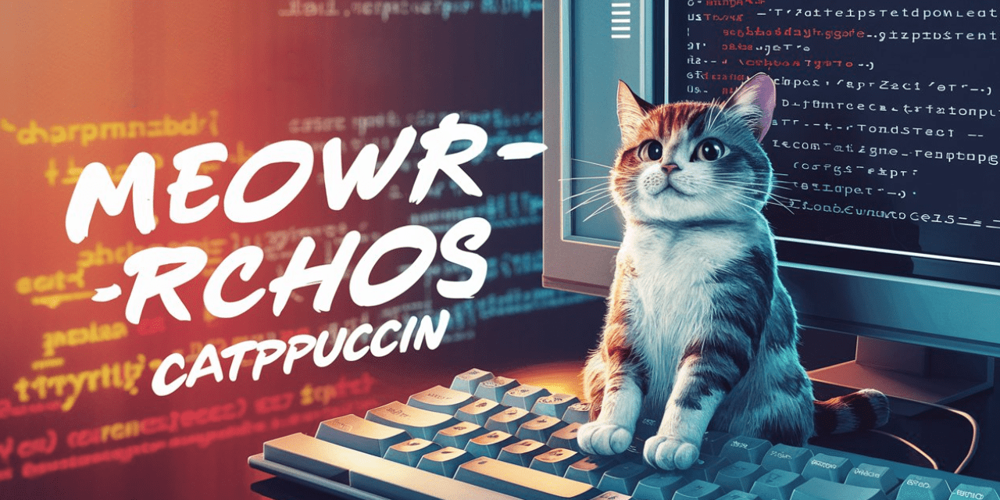
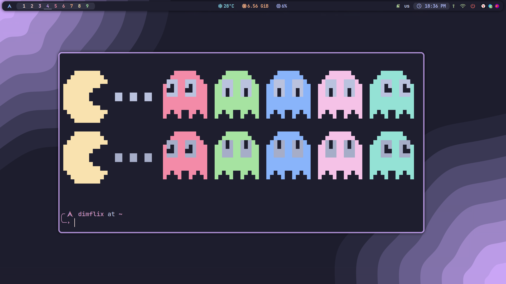
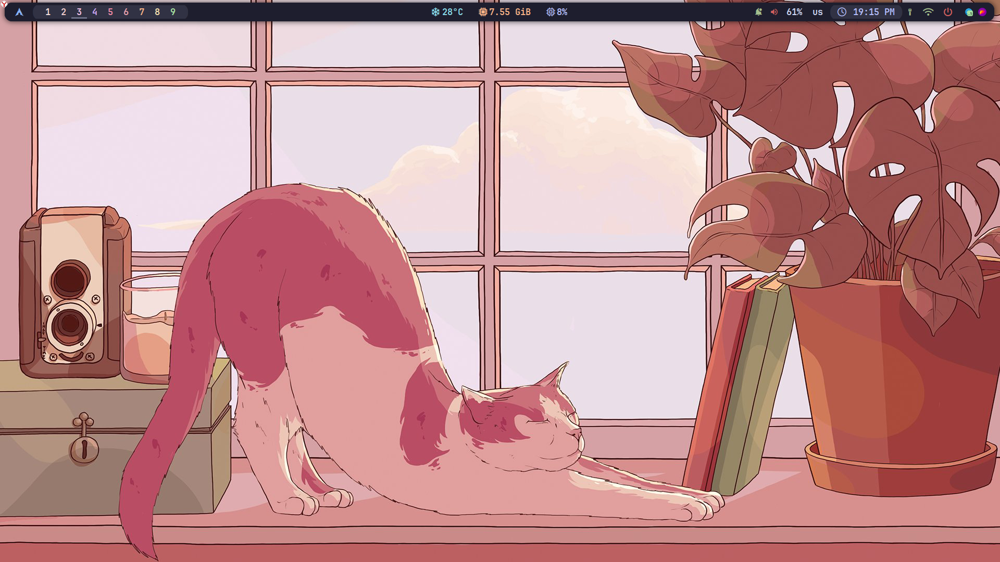
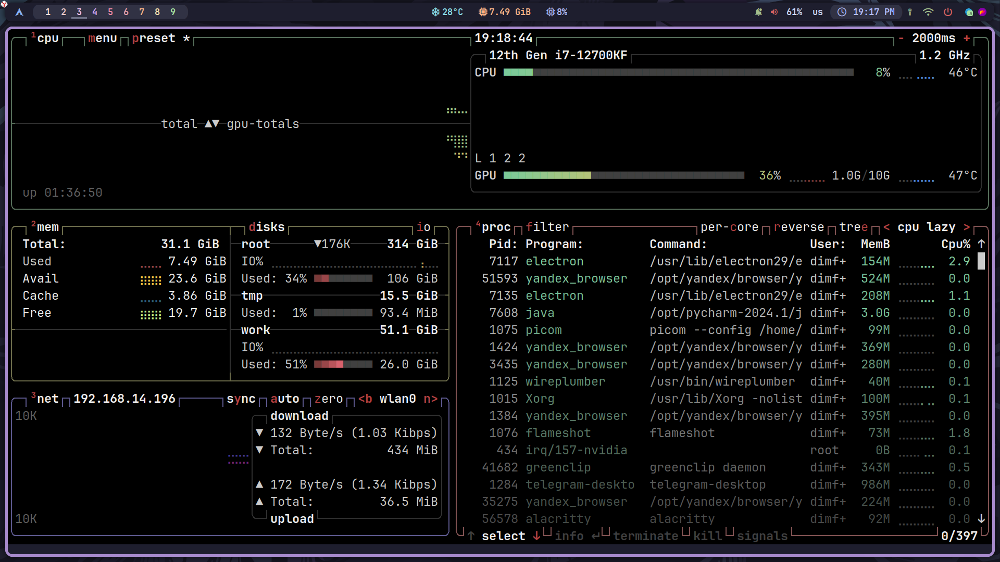
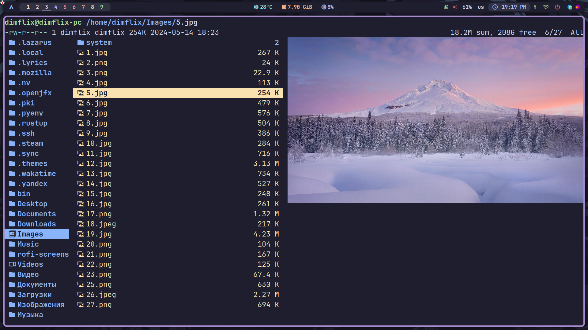
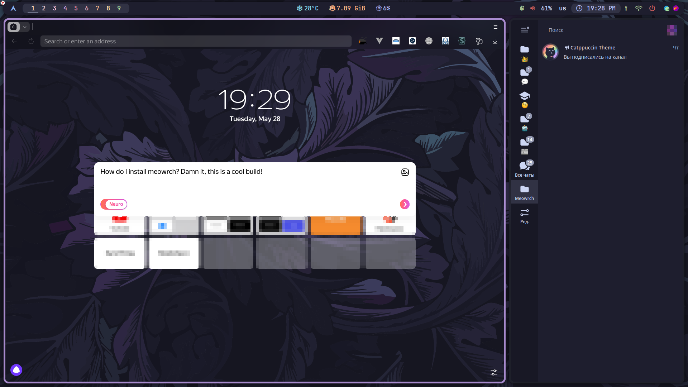

<h1 align="center"> 🐾 Meowrch OS  </h1>

<!-- BADGES -->

<p align="center">
  
  
  
  </br>
</p>

<!-- INFORMATION -->
<h1 align="left"> 📝 О проекте</h1> 
<p>MeowrchOS - сборка, основанная на Arch, заточенная под максимальную производительность, а так-же эргономичность.
В первую очередь она предназначена для владельца данного репозитория, но при этом вы имеете все права и возможности
использовать данный setup.</p><br>



 - OS: [**`Arch Linux`**](https://archlinux.org/)
 - WM: [**`BSPWM`**](https://github.com/baskerville/bspwm)
 - Bar: [**`Polybar`**](https://github.com/polybar/polybar)
 - Compositor: [**`Picom`**](https://github.com/yshui/picom)
 - Terminal: [**`Alacritty`**](https://github.com/alacritty/alacritty)
 - App Launcher: [**`Rofi`**](https://github.com/davatorium/rofi)
 - Notify Daemon: [**`Dunst`**](https://github.com/dunst-project/dunst)
 - Shell: [**`Fish`**](https://github.com/fish-shell/fish-shell)

</br>


<!-- IMAGES -->
## 🖼️ Мини-обзор







<!-- FEATURES -->
## 🚀 Особенности
* Гибкая настройка программного обеспечения в системе.
* Множество удобных скриптов в bin/.
* Удобная пользовательская настройка Firefox.
* Все горячие клавиши заточены под обеспечение максимальной производительности.
* Очень легкая система, которая потребляет менее 1гб памяти.
* Автоматическая установка и настройка всего базового программного обеспечения для разработки.
* Красивая тема "Catppuccin" по умолчанию.
* Кастомный GRUB.
* Постоянная поддержка проекта, т.к я сам ее повседневно использую

**И множество других фич: [EN](Docs/03_all_features_and_tricks_english.md), [RU](Docs/02_all_features_and_tricks_russian.md)**

> [!WARNING]
> ДАННАЯ КОНФИГУРАЦИЯ ПРЕДНАЗНАЧЕНА ДЛЯ МОНИТОРОВ С РАЗРЕШЕНИЕМ 1920X1080,
> НЕКОТОРЫЕ ФУНКЦИИ ОБОЛОЧКИ МОГУТ РАБОТАТЬ НЕПРАВИЛЬНО.
> В ЭТОМ СЛУЧАЕ ВАМ НЕОБХОДИМО ВНЕСТИ ИЗМЕНЕНИЯ ВРУЧНУЮ.
> ЕСЛИ ВЫ ОБНАРУЖИТЕ ОШИБКИ В ОБОЛОЧКЕ, ПОЖАЛУЙСТА, СООБЩИТЕ О ПРОБЛЕМЕ.

<!-- INSTALLATION -->
## 🛠 Установка
Если у вас уже установлен Linux Arch, то выполняем следующие действия:
1. Устанавливаем базовые пакеты
   ```
    sudo pacman -Sy
    sudo pacman -S xorg bspwm sxhkd xorg-xinit xterm git python3
    ```
2. Редактируем конфигурацию xinitrc \
   `micro /etc/X11/xinit/xinitrc` \
   Вам нужно отключить любые другие строки exec и добавить в конец файла строку:
   `exec bspwm`
3. Загрузим репозиторий и начнем процесс установки. Не советую редактировать `BASE_PACKAGES`, так как они необходимы для правильной работы оболочки, однако вы свободно можете редактировать другие виды пакетов. На этапе билдера вам будет предложено установить `DEV_PACKAGES`, они не нужны для системы, но могут быть полезны для разработки. Выбирайте пункты на свое усмотрение.
   ```
   git clone https://github.com/DIMFLIX-OFFICIAL/meowrch.git
   cd meowrch
   python3 Builder/install.py
   ```
4. Если вы сделали всё правильно, то уже можно начать пользоваться сборкой. `startx`

Полное руководство по установке системы и графической оболочки с помощью builder: [EN](Docs/01_installing_arch_linux_with_bspwm_english.md), [RU](Docs/00_installing_arch_linux_with_bspwm_russian.md). 

<!-- ERRORS -->
## 🩹 Исправление ошибок после установки
* **Яркость экрана не отображается на панели**. Эта ошибка связана с тем, что билдеру не удалось автоматически установить драйверы для видеокарты или процессора. Вам необходимо перейти на [Arch Wiki](https://wiki.archlinux.org) и выполнить установку вручную.
* **Уровень заряда батареи не отображается на панели**. Вам необходимо открыть `~/bin/battery-alert` и изменить значение параметра `battery` на значение вашего заряда батареи. Затем перейдите в `~/.config/polybar/modules.ini` и отредактируйте модуль `[module/battery]` в соответствии с инструкциями polybar, чтобы он соответствовал вашим данным "battery" и "adapter".
* **Зависает анимация или терминалы**. Проблема в том, что вы, возможно, не используете графические драйверы или работаете с виртуальной машины. Вам нужно открыть "~/.config/bspwm/bspwmrc" и закомментировать строку с запуском `picom`.
* **Проблема с интерфейсом**. Если вы не используете монитор с разрешением 1920x1080, интерфейс может выглядеть не так, как должен выглядеть. В этом случае вам необходимо вручную отредактировать конфигурацию.
* **Ошибка в имени пользователя**. На этом этапе конфигурация устанавливается локально для пользователя, с которого был запущен конструктор. Также имя пользователя должно быть "user", чтобы система работала должным образом. Если вы получите эту ошибку, вам нужно создать нового пользователя с именем `user` и повторить установку.
* **Другие ошибки**. Если вы обнаружили ошибки, которых здесь нет, и уверены, что следовали инструкциям, обязательно свяжитесь с нами, чтобы мы могли исправить ошибку в следующем обновлении.


<!-- HOTKEYS -->
## 💻 HotKeys
* **Открыть терминал** - `super + enter`
* **Сменить раскладку** - `shift + alt`
* **Открыть меню приложений** - `super + d`
* **Завершить сеанс** - `super + x`
* **Распознать цвет на экране** - `super + c`
* **Заблокировать экран** - `super + l`
* **Открыть календарь** - `super + k`
* **Запустить firefox** - `super + shift + f`
* **Закрыть активное окно** - `super + q`
* **Сделать скриншот** - `print`
* **Перезапустить bspwm** - `ctrl + shift + r`
* **Переключиться на другую рабочую область** - `super + 1/9`
* **Перенести активное окно на другую рабочую область** - `super + shift + 1/9`
* **Перевести активное окно в плавающий режим** - `super + space`

Остальная конфигурация находится в `~/.config/sxhkd/sxhkdrc`.

***

Проект активно развивается, поэтому вы можете предложить свои идеи по улучшению. 
Если остались вопросы, - добро пожаловать в телеграм: `@dimflix_official` \
Отдельная благодарность за толчок в этом направлении - [Zproger](https://github.com/Zproger) ❤️
